<!-- ═══════════════════════════════════════════════════════════════ -->

<!--                    ANA LUIZA OLIVEIRA                          -->

<!-- ═══════════════════════════════════════════════════════════════ -->

<div align="center">


<br>


<br>
</div>

---

<div align="center">

```text
╔══════════════════════════════════════════════════════════════╗
║                                                              ║
║   > SYSTEM BOOT                                              ║
║                                                              ║
║   USER       :: ANALU007                                     ║
║   ROLE       :: SOFTWARE_DEVELOPER_IN_PROGRESS               ║
║   CURRENT    :: QA_ANALYST                                   ║
║   MODE       :: BUILDING                                     ║
║   STATUS     :: ● ONLINE                                     ║
║                                                              ║
║   [████████████████████████████████████████] 100%            ║
║                                                              ║
╚══════════════════════════════════════════════════════════════╝
```

</div>

## `> about_me`

<div align="center">

<table>
<tr>
<td width="55%" valign="top">

### `ANALU007.EXE`

```text
┌─────────────────────────────────────────┐
│                                         │
│  Information Systems Student            │
│  Systems Development Technician         │
│  QA Analyst                             │
│  Software Developer in Progress         │
│                                         │
│  Focus:                                 │
│  ├── Backend Development                │
│  ├── Artificial Intelligence            │
│  ├── Automation                         │
│  ├── Data & SQL                         │
│  └── Software Quality                   │
│                                         │
└─────────────────────────────────────────┘
```

Sou estudante de **Sistemas de Informação** e técnica em **Desenvolvimento de Sistemas**, atualmente atuando como **QA Analyst**.

Minha trajetória está direcionada para **Software Development**, utilizando QA como uma forma de aprofundar meu entendimento sobre sistemas, arquitetura, regras de negócio e qualidade de software.

Gosto de transformar problemas em soluções através de **código, automação, dados e tecnologia**.

</td>

<td width="45%" align="center">


<br><br>

```text
╭──────────────────────────╮
│   CURRENT MISSION        │
├──────────────────────────┤
│                          │
│  BUILD                   │
│  AUTOMATE                │
│  TEST                    │
│  LEARN                   │
│  EVOLVE                  │
│                          │
╰──────────────────────────╯
```

</td>
</tr>
</table>

</div>

---

<div align="center">


### `> CURRENT_FOCUS`


</div>

---

## `> tech_stack`

<div align="center">

### `LANGUAGES`


<br>

### `FRONT-END`


<br>

### `BACK-END`


<br>

### `DATABASES`


<br>

### `CACHE / IN-MEMORY`


<br>

### `VERSION CONTROL`


<br>

### `TOOLS`


<br>

### `AUTOMATION / QUALITY / AGILE`


<br>

### `DATA / ANALYTICS`


<br>

### `API / DEVELOPMENT`


</div>

---

> **Status:** Always learning. Always building.

---

## `> featured_projects`

<table>
<tr>

<td width="33%" valign="top">

### 🐾 Paws Palace

Sistema web completo para um petshop.

**Features**

* E-commerce
* Cadastro de clientes
* Cadastro de pets
* Agendamento
* Gestão de serviços

**Stack**

`PHP` `JavaScript` `HTML` `CSS` `MySQL`

</td>

<td width="33%" valign="top">

### 🍽️ Sabor Local

Aplicação de delivery desenvolvida durante a graduação.

**Features**

* Cadastro de usuários
* Cardápio
* Pedidos
* Gestão
* Automação via Telegram

**Stack**

`FlutterFlow` `Xano` `n8n` `Figma`

</td>

<td width="33%" valign="top">

### 🤖 ESP32 Sumo Robot

Robô desenvolvido para competição de sumô.

**Features**

* Bluetooth
* Sensor ultrassônico
* Sensor óptico
* Controle de motores

**Stack**

`ESP32` `Python` `Sensors` `Bluetooth`

</td>

</tr>
</table>

---

## `> professional_mode`

<div align="center">

```text
╭──────────────────────────────────────────────────────────────╮
│                                                              │
│  CURRENT ROLE                                                │
│                                                              │
│  QA ANALYST                                                  │
│  ──────────────────────────────────────────────────────────  │
│                                                              │
│  • Manual Testing                                            │
│  • Automated Testing                                         │
│  • Bug Identification & Tracking                             │
│  • Business Rules Validation                                 │
│  • Jira                                                      │
│  • Scrum / Kanban                                            │
│  • BDD                                                       │
│                                                              │
│  ──────────────────────────────────────────────────────────  │
│                                                              │
│  CAREER DIRECTION                                            │
│                                                              │
│  QA  ────────────────►  SOFTWARE DEVELOPMENT                 │
│                                                              │
╰──────────────────────────────────────────────────────────────╯
```

</div>

---

## `> github_statistics`
<div align="center">





<br><br>


</div>

---

## `> contribution_network`

<div align="center">


</div>

---

## `> contribution_snake`

<div align="center">

<picture> <source media="(prefers-color-scheme: dark)" srcset="https://raw.githubusercontent.com/analu007/analu007/output/github-snake-dark.svg"> <source media="(prefers-color-scheme: light)" srcset="https://raw.githubusercontent.com/analu007/analu007/output/github-snake.svg">  </picture>

</div>

---

## `> certifications`

<div align="center">


<br><br>

```text
> continuous_learning = TRUE

> knowledge_base += Python
> knowledge_base += Artificial_Intelligence
> knowledge_base += Software_Development
> knowledge_base += Automation
> knowledge_base += Quality
```

</div>

---

## `> beyond_code`

<div align="center">


<br>

🧩 Puzzles    ◆    🧠 Problem Solving    ◆    ⚽ Sports    ◆    🎯 Curiosity

</div>

---

## `> connect`

<div align="center">

<a href="https://github.com/analu007">

</a>

<a href="https://www.linkedin.com/in/ana-oliveira007/">

</a>

</div>

<br>

<div align="center">

```text
╔══════════════════════════════════════════════════════════════╗
║                                                              ║
║  > ./analu007 --status                                       ║
║                                                              ║
║  [ONLINE]                                                    ║
║                                                              ║
║  Building software.                                          ║
║  Exploring AI.                                               ║
║  Automating processes.                                       ║
║  Testing ideas.                                              ║
║  Learning constantly.                                        ║
║                                                              ║
║  ──────────────────────────────────────────────────────────  ║
║                                                              ║
║       CODE  •  AUTOMATE  •  TEST  •  EVOLVE  •  REPEAT       ║
║                                                              ║
╚══════════════════════════════════════════════════════════════╝
```


</div>

<div align="center">

```text
╔══════════════════════════════════════════════╗
║       SYSTEM TERMINATED... JUST KIDDING.     ║
╚══════════════════════════════════════════════╝
```
</div>
